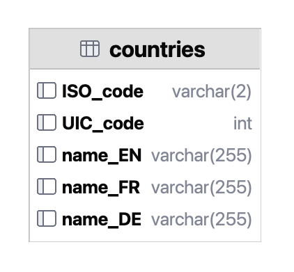

# 🛤️ kalauz

## 📖 About

A program for
1. **processing** rail network operator companies' internal, dirty **spreadsheets** of speed restrictions
2. **storing** that data in a **mySQL-database**
3. **visualizing** the speed restrictions on a **map.**


## 📋 Features

* Processes the following companies' spreadsheets of SRs in the following formats:
  * [MÁV Magyar Államvasutak Zrt.](https://www.mavcsoport.hu/mav/bemutatkozas) ([.pdf](data/01_import/MÁV_2022-08-08_ASR.pdf))
  * [GySEV Zrt.](https://www2.gysev.hu/palyavasuti-uzletag) ([.xlsx](data/01_import/GYSEV_2022-05-13_ASR.xlsx))
* Stores them in a mySQL-database with the following schema:
  <!--- replace the .png extension below with .svg when https://youtrack.jetbrains.com/issue/DBE-17864/ is fixed -->
  


## 📥 Installation

```bash
make install
```


## 📦 Dependencies

* [Python](https://www.python.org/downloads/) 3.9+
* [mySQL](https://dev.mysql.com/downloads/mysql/) 5.6+
  * Store your database password in a `DATABASE_PASSWORD` variable 
    in a .env file in the root directory of the project.


## 📚 Reference

Used abbreviations:
* SR = speed restriction
* TSR = temporary speed restriction
* ASR = all speed restrictions
* MU = multiple unit.


## 📜 License

This project is licensed under the _GNU General Public License v3.0_.
See the [license](COPYING) file for the full text.


## 🏦 Funding

This project was a part of the scholarship application _[ÚNKP-23-1-I-BME-354](https://archive.org/download/scholarship_funding_contract_unkp-23-1-i-bme-354_20231010/scholarship_funding_contract_U%CC%81NKP-23-1-I-BME-354_20231010.pdf)_ 
which was granted `1,000,000 HUF` (~`2,600 EUR` in 2023)
from the [National Research, Development and Innovation Fund](https://nkfih.gov.hu/palyazoknak/nkfi-alap/unkp-23-tamogatott-intezmenyek)
by the [New National Excellence Program](https://www.unkp.gov.hu/palyazatok/felsooktatasi-alapkepzes-hallgatoi-kutatoi-osztondij) 
of the [Hungarian Ministry for Culture and Innovation](https://kormany.hu/kulturalis-es-innovacios-miniszterium).