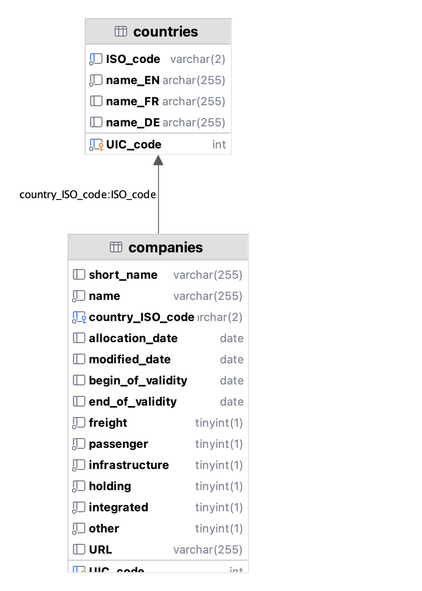

# 🛤️ kalauz

[](https://github.com/psf/black)
[](https://makeapullrequest.com)


## 📖 About

A program for...
* **processing** rail network operator companies' internal, dirty **spreadsheets** of speed restrictions
* **storing** that data in a MySQL **database**
* **visualizing** the speed restrictions on a **map.**


## 📋 Features

* Processes the following companies' spreadsheets of SRs in the following formats:
  * [MÁV Magyar Államvasutak Zrt.](https://www.mavcsoport.hu/mav/bemutatkozas) ([.pdf](data/01_import/MÁV_2022-08-08_ASR.pdf))
  * [GySEV Zrt.](https://www2.gysev.hu/palyavasuti-uzletag) ([.xlsx](data/01_import/GYSEV_2022-05-13_ASR.xlsx))
* Stores them in a MySQL database with the following schema:

  <!--- TODO: report images below not rendering correctly in the Preview panel to JetBrains developers --->
  <!--- TODO: replace the .png extension below with .svg when https://youtrack.jetbrains.com/issue/DBE-17864/ is fixed -->
  <picture>
    <source media="(prefers-color-scheme: light)" srcset="img/database_schema_light.png" height="600"/>
    <source media="(prefers-color-scheme: dark)" srcset="img/database_schema_dark.png" height="600"/>
    
  </picture>


## 📥 Installation

1. [Clone the repository](https://docs.github.com/en/repositories/creating-and-managing-repositories/cloning-a-repository)
2. Run the following command in the terminal:

  ```bash
  cd kalauz && make install
  ```


### 📦 Dependencies

* [Python](https://www.python.org/downloads/) `3.9+`
* [MySQL](https://dev.mysql.com/downloads/mysql/) `5.6+`
  * Store your database password in a `DATABASE_PASSWORD` variable 
    in a `.env` file in the root of the repository.

### 🛠️ For development

* [mypy](https://github.com/python/mypy)


## 📚 Reference

Abbreviations used:
* SR = speed restriction
* TSR = temporary speed restriction
* ASR = all speed restrictions
* MU = multiple unit.


## 📜 License

This project is licensed under the _GNU General Public License v3.0_.
See the [license](copying.txt) file (or the _GPL-3.0 license_ tab on GitHub) for its full text.


## 🏦 Funding

This project was a part of the scholarship application [ÚNKP-23-1-I-BME-354](https://archive.org/download/scholarship_funding_contract_unkp-23-1-i-bme-354_20231010/scholarship_funding_contract_U%CC%81NKP-23-1-I-BME-354_20231010.pdf) 
which was granted _1,000,000 HUF_ (~_2,600 EUR_ in 2023)
from the [National Research, Development and Innovation Fund](https://nkfih.gov.hu/palyazoknak/nkfi-alap/unkp-23-tamogatott-intezmenyek)
by the [New National Excellence Program](https://www.unkp.gov.hu/palyazatok/felsooktatasi-alapkepzes-hallgatoi-kutatoi-osztondij) 
of the [Hungarian Ministry for Culture and Innovation](https://kormany.hu/kulturalis-es-innovacios-miniszterium).