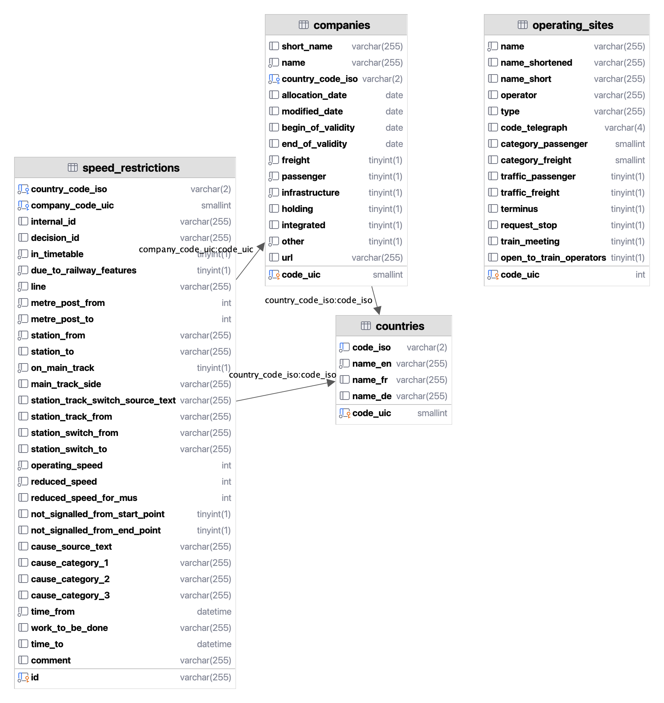

# 🛤️ kalauz


[](https://scrutinizer-ci.com/g/gy-mate/kalauz/build-status/master)
[](https://scrutinizer-ci.com/g/gy-mate/kalauz/)
[](https://docs.python.org/3/library/typing.html)
[](https://github.com/psf/black)

[](https://github.com/gy-mate/moodle-to-vikwikiquiz/commits/main/)

[](https://docs.github.com/en/pull-requests/collaborating-with-pull-requests/proposing-changes-to-your-work-with-pull-requests/creating-a-pull-request)

## 📥 Installation

1. [Clone the repository](https://docs.github.com/en/repositories/creating-and-managing-repositories/cloning-a-repository)
1. Run the following command in the terminal:

  ```bash
  cd kalauz && make install
  ```


### 📦 Dependencies

- [Python](https://www.python.org/downloads/) `3.10+`
- [MySQL](https://dev.mysql.com/downloads/mysql/) `5.6+`
  - Store your database password in a `DATABASE_PASSWORD` variable 
    in a `.env` file in the root of the repository.
- A [ConvertAPI](https://www.convertapi.com) account ([pricing](https://www.convertapi.com/prices))
  - Store your API secret in a `CONVERTAPI_SECRET` variable 
    in a file named `.env` in the root of the repository.


## 📖 About

A program for...
- **processing** rail network operator companies' internal, dirty **spreadsheets** of speed restrictions
- **storing** that data in a MySQL **database**
- **visualizing** the speed restrictions on a **map.**


### 📋 Features

- Processes the following companies' spreadsheets of SRs in the following formats:
  - [MÁV Magyar Államvasutak Zrt.](https://www.mavcsoport.hu/mav/bemutatkozas) ([`.pdf`](data/01_received/MÁV_kje4v43hacb32.pdf) converted to `.xlsx`)
  - [GYSEV Zrt.](https://www2.gysev.hu/palyavasuti-uzletag) ([`.xlsx`](data/02_converted/GYSEV_2022-05-13_ASR.xlsx))
- Stores them in a MySQL database with the following schema:
  <!--- TODO: report images below not rendering correctly in the Preview panel to JetBrains developers --->
  <!--- TODO: replace the .png extension below with .svg when https://youtrack.jetbrains.com/issue/DBE-17864/ is fixed -->
  <picture>
    <source media="(prefers-color-scheme: light)" srcset="img/database_schema_light.png" height="600"/>
    <source media="(prefers-color-scheme: dark)" srcset="img/database_schema_dark.png" height="600"/>
    
  </picture>
- Visualizes them on a map using `pydeck`.


#### ⚙️ How it works

- Importing
  - The program reads the spreadsheets from the `data/01_received` directory.
  - It converts the `.pdf` files to `.xlsx` files using the [ConvertAPI](https://convertapi.com).
  - It stores the converted files in the `data/02_converted` directory.
  - It reads the `.xlsx` files and extracts the SRs.
- Processing
  - It categorizes the cause of the SRs using AI ([`scikit-learn`](https://scikit-learn.org/stable/index.html)):
    - feature extraction (student): [`TfidfVectorizer`](https://scikit-learn.org/stable/modules/generated/sklearn.feature_extraction.text.TfidfVectorizer.html) ([term frequency–inverse document frequency](https://en.wikipedia.org/wiki/Tf–idf) vectorizer)
    - linear model (estimator / predictor – it can constantly learn): [`SGDClassifier`](https://scikit-learn.org/stable/modules/generated/sklearn.linear_model.SGDClassifier.html) ([stochastic gradient descent](https://en.wikipedia.org/wiki/Stochastic_gradient_descent) classifier)
      - extending it to a multioutput estimator: [`MultiOutputClassifier`](https://scikit-learn.org/stable/modules/generated/sklearn.multioutput.MultiOutputClassifier.html#sklearn.multioutput.MultiOutputClassifier)
- Storing
  - It stores the SRs in a MySQL database.
- Visualizing
  - It visualizes the SRs on a map using pydeck.


### 📚 Reference

| abbreviation | meaning                     |
|--------------|-----------------------------|
| SR           | speed restriction           |
| TSR          | temporary speed restriction |
| ASR          | all speed restrictions      |
| MU           | multiple unit               |
| MP           | multipolygon                |


## 🏦 Funding

This project was a part of the scholarship application [ÚNKP-23-1-I-BME-354](https://archive.org/download/scholarship_funding_contract_unkp-23-1-i-bme-354_20231010/scholarship_funding_contract_U%CC%81NKP-23-1-I-BME-354_20231010.pdf) 
which was granted _1,000,000 HUF_ (~_2,600 EUR_ in 2023)
from the [National Research, Development and Innovation Fund](https://nkfih.gov.hu/palyazoknak/nkfi-alap/unkp-23-tamogatott-intezmenyek)
by the [New National Excellence Program](https://www.unkp.gov.hu/palyazatok/felsooktatasi-alapkepzes-hallgatoi-kutatoi-osztondij) 
of the [Hungarian Ministry for Culture and Innovation](https://kormany.hu/kulturalis-es-innovacios-miniszterium).


## 📜 License

This project is licensed under the _GNU General Public License v3.0_.
See the [license](copying.txt) file (or the _GPL-3.0 license_ tab on GitHub) for its full text.
